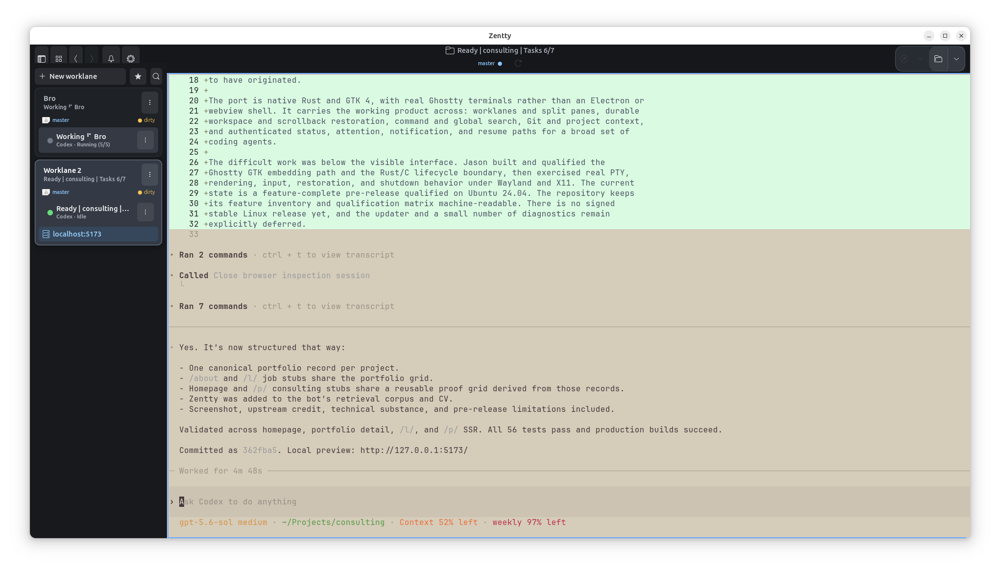

<h1 align="center">
  <br>
  Tornado TTY
</h1>

<p align="center">
  <strong>A native Linux terminal workspace for coding agents, built with Rust, GTK 4, and Ghostty.</strong><br>
  Worklanes, real terminal panes, workspace restoration, and coding-agent awareness
  in a native Linux application—without Electron or a web view.
</p>

<p align="center">
  <a href="https://tamedtornado.com/products/tornado-tty">Product page</a> ·
  <a href="#install-on-ubuntu-2404">Install</a> ·
  <a href="https://github.com/TamedTornado/TornadoTTY/releases">Releases</a> ·
  <a href="#build-and-run-for-development">Build</a> ·
  <a href="#project-status">Status</a> ·
  <a href="docs/cli.md">CLI</a> ·
  <a href="CONTRIBUTING.md">Contributing</a>
</p>

> [!IMPORTANT]
> TornadoTTY is an unofficial fork of Zentty. It is not affiliated with or
> endorsed by Zenjoy BV. The original Zentty project is created and maintained
> by [dedene](https://github.com/dedene/zentty) for macOS.

> [!NOTE]
> The Linux build uses [Tamed Tornado's Ghostty fork](https://github.com/TamedTornado/ghostty),
> which carries the narrow GTK host-embedding API needed to own real Ghostty
> surfaces from the Rust application. The exact reviewed revision is pinned in
> [`linux/ghostty.lock`](linux/ghostty.lock); terminal-product policy remains
> in TornadoTTY.



## What works

- **Worklanes and panes.** Create, rename, reorder, color, navigate, move,
  split, close, restore, and arrange real Ghostty terminals with independent
  PTYs.
- **Durable workspaces.** Window, worklane, pane, layout, working-directory,
  scrollback, and supported coding-agent restore state survive ordinary
  relaunches and crash recovery.
- **Keyboard-first control.** Bindable commands, command palette, pane and
  worklane navigation, Worklane Peek, pane-local search, and Global Find.
- **Agent awareness.** Managed hooks, authenticated local IPC, sidebar status,
  attention routing, notifications, and safe resume behavior for supported
  coding agents including Codex, Claude Code, Gemini CLI, GitHub Copilot CLI,
  OpenCode, Amp, Cursor, Droid, Kimi, Grok, Antigravity, Hermes Agent, Mistral
  Vibe, Pi, OMP, and Small Harness. Explicit custom-agent status is supported
  through the same protocol.
- **Project context.** Git branch and pull-request state, bookmarks and
  workspace presets, Open With actions, development-server discovery, task
  runners, and a process Task Manager.
- **Terminal workflows.** Ghostty themes, light and dark appearance, clean/raw
  and Markdown copy, URL activation, local and SSH file transfer, scrolling,
  selection, IME input, and Wayland/X11 support.
- **Scriptable automation.** The packaged `tornadotty-cli` uses the same
  authenticated command API as the GUI. See [`docs/cli.md`](docs/cli.md).

The source-backed feature inventory is
[`docs/design/zentty-linux-feature-inventory.json`](docs/design/zentty-linux-feature-inventory.json).
Behavior invented or improved in the Linux port is tracked separately in the
[`Linux-originated enhancements register`](docs/linux-originated-enhancements.md).

## Project status

The Linux port is in **daily-dogfood / pre-release** status. It is useful now,
but it has not yet published a signed stable Linux release.

- The initial product feature inventory is implemented.
- Native packages target **Ubuntu 24.04 LTS (Noble), amd64** and **Omarchy 4,
  x86_64**.
- Both GTK Wayland and X11 paths are exercised by controlled real-product
  integration journeys. Desktop- and GPU-specific defects may still exist.
- Linux update discovery and installation UI is intentionally deferred. Install
  upgrades explicitly with a newer `.deb` or `.pkg.tar.zst`.
- The optional terminal performance diagnostics overlay is deferred.
- Task Manager network/container telemetry is a future enhancement.
- The qualification matrix still contains explicit blocked, expected-failure,
  and deferred cells. This README does **not** claim exhaustive or full Linux
  qualification.

Open work is tracked in the fork's
[GitHub issues](https://github.com/TamedTornado/TornadoTTY/issues). The machine-readable
qualification authority is
[`linux/qualification-matrix.json`](linux/qualification-matrix.json).

## Install on Ubuntu 24.04

Download the latest Linux prerelease `.deb` and `SHA256SUMS` from the
[GitHub Releases page](https://github.com/TamedTornado/TornadoTTY/releases), verify
it, and install it with APT:

```bash
sha256sum --check --ignore-missing SHA256SUMS
sudo apt install ./tornadotty_*_amd64.deb
```

Launch Tornado TTY from the desktop application menu or run `tornadotty`.

## Install on Omarchy 4

Download the latest `.pkg.tar.zst` and `SHA256SUMS` from the
[GitHub Releases page](https://github.com/TamedTornado/TornadoTTY/releases), then:

```bash
sha256sum --check --ignore-missing SHA256SUMS
sudo pacman -U ./tornadotty-*-x86_64.pkg.tar.zst
```

The Omarchy artifact is built natively for the Arch package family. Release
qualification exercises real pacman install, upgrade, installed-product help,
and uninstall transitions on Omarchy 4.

## Build a package from source

Package construction requires a clean checkout. The Ubuntu bootstrap below is
also the supported development setup.

### 1. Install the reviewed Ubuntu build environment

The repository owns a pinned Ubuntu environment manifest and bootstrap. Run
the package installation as root, but install the pinned language tools as
your normal user:

```bash
sudo apt-get update
sudo apt-get install -y jq
mapfile -t packages < <(linux/ci/bootstrap-ubuntu-24.04 --print-apt)
sudo apt-get install -y "${packages[@]}"
linux/ci/bootstrap-ubuntu-24.04 --no-system-install
```

The bootstrap downloads content-pinned toolchains and verifies their hashes.
It includes qualification dependencies as well as the smaller build-time set,
so it is intentionally substantial and reviewable rather than minimal.

### 2. Build the Debian package

Package construction requires a clean checkout:

```bash
linux/scripts/prepare-ghostty-source
ZENTTY_GHOSTTY_PREPARED=true linux/scripts/build-deb
```

Verify and install the resulting artifact:

```bash
cd build/linux-package
sha256sum --check --strict SHA256SUMS
dpkg-deb --info ./tornadotty_*_amd64.deb
cd ../..
sudo apt install ./build/linux-package/tornadotty_*_amd64.deb
```

Launch Tornado TTY from the desktop application menu or run:

```bash
tornadotty
```

The command API is available as:

```bash
tornadotty-cli --help
```

The complete package ownership, upgrade, removal, and retained-user-data
contract is documented in
[`linux/packaging/README.md`](linux/packaging/README.md).

## Build and run for development

After completing the reviewed environment bootstrap above:

```bash
linux/scripts/build-local
linux/scripts/run-local
```

`build-local` prepares the pinned Ghostty fork and builds a ReleaseSafe Rust/GTK
application bundle under `build/linux/`. `run-local` launches that exact staged
bundle using its packaged-style relative library paths.

Use an isolated state directory when experimenting without your normal
workspace:

```bash
linux/scripts/run-local \
  --state-directory /tmp/zentty-state \
  --no-session-restore
```

The binary exposes launch options and exact build provenance without starting
GTK:

```bash
build/linux/bin/zentty-linux --help
build/linux/bin/zentty-linux --version
```

For compatibility with existing workspaces and hooks, Linux configuration
continues to live at `$XDG_CONFIG_HOME/zentty/config.toml`, falling
back to `~/.config/zentty/config.toml`. See
[`docs/configuration.md`](docs/configuration.md).

## Architecture and testing

The Linux application is not a re-skinned web terminal:

- product and portable model code are written in Rust;
- the native shell uses `gtk4-rs`;
- terminal rendering and PTY behavior come from a narrow embedding API in the
  [maintained Tamed Tornado Ghostty GTK fork](https://github.com/TamedTornado/ghostty);
- TornadoTTY worklane, agent, settings, and persistence policy stays out
  of Ghostty; and
- the macOS Swift implementation and tests remain the behavioral source for
  port parity.

Real-product integration tests launch the delivered executable with real GTK,
Ghostty surfaces, PTYs, processes, filesystems, local IPC, and controlled X11
or Wayland environments. External coding-model responses are controlled where
necessary. Focused tests cover deterministic models and parsers.

For the architecture decision, test policy, and chronological field evidence,
see:

- [`docs/architecture/0001-rust-gtk4-linux-product.md`](docs/architecture/0001-rust-gtk4-linux-product.md)
- [`linux/test-policy/README.md`](linux/test-policy/README.md)
- [`linux/README.md`](linux/README.md)
- [`docs/design/zentty-linux-dogfood-2026-08-01.md`](docs/design/zentty-linux-dogfood-2026-08-01.md)

The full local qualification entry point is available for release work, but is
not required for ordinary development or every bug fix:

```bash
linux/tests/qualify-local
```

## macOS and upstream Zentty

For the official macOS application, signed `.dmg`, Sparkle updates, macOS build
instructions, and upstream feature development, visit
[`dedene/zentty`](https://github.com/dedene/zentty).

This fork keeps its `main` branch as an upstream/macOS tracking branch. The
Linux product is developed on `linux/port`, which is the intended default
landing branch for this fork.

## Contributing

Contributions are welcome. Start with [`CONTRIBUTING.md`](CONTRIBUTING.md).
Before a non-trivial contribution can be merged, contributors must agree to
[`CLA.md`](CLA.md).

Please keep product policy in TornadoTTY unless Ghostty itself owns the
behavior. Changes to the maintained Ghostty fork should remain minimal,
independently tested, and suitable for upstream review.

## License, attribution, and trademarks

Zentty is available under the GNU General Public License v3.0 only
(`GPL-3.0-only`). See [`LICENSE`](LICENSE).

The original Zentty design and macOS implementation are by
[dedene](https://github.com/dedene/zentty) and its contributors. Ghostty is by
Mitchell Hashimoto and the Ghostty contributors. Third-party notices for the
packaged Linux artifact are generated and verified during packaging.

The GPL license covers the code. It does not grant rights to use the Zentty
name, logos, icons, or other branding for unrelated distributions. See
[`TRADEMARKS.md`](TRADEMARKS.md).
